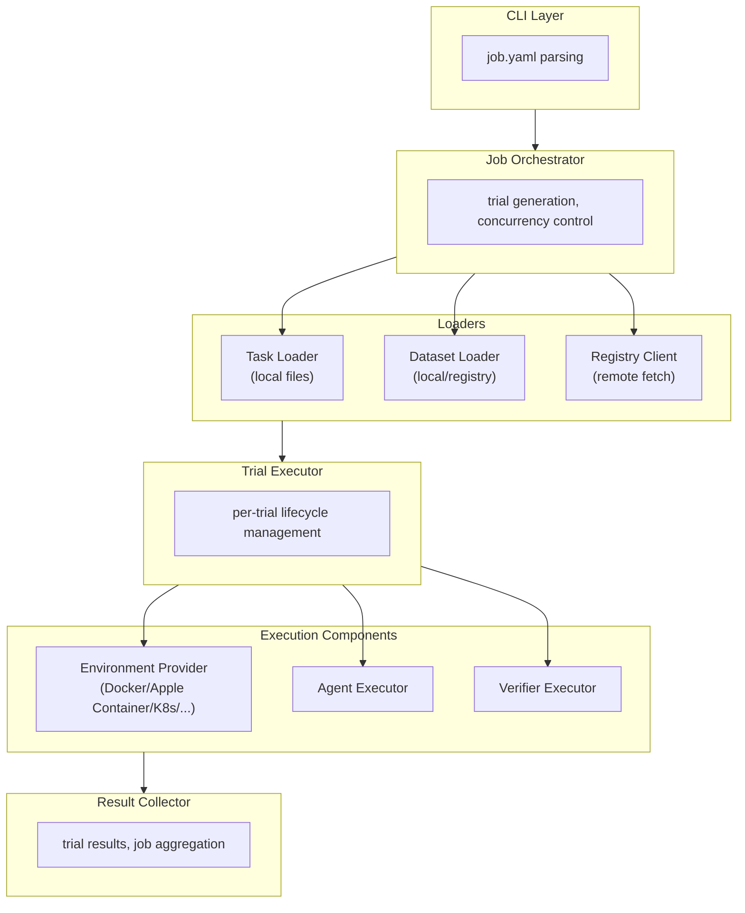
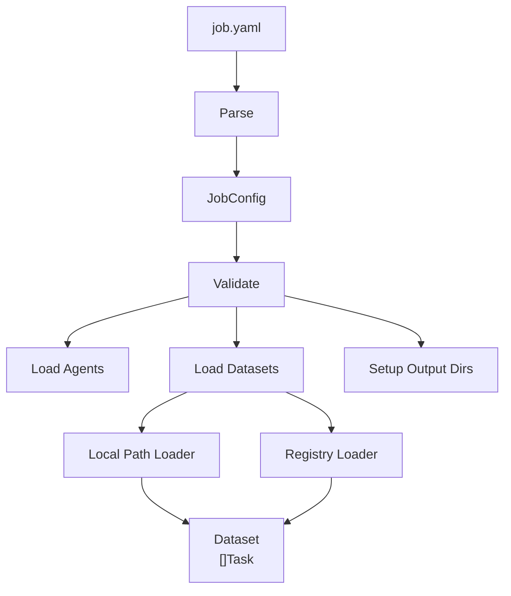
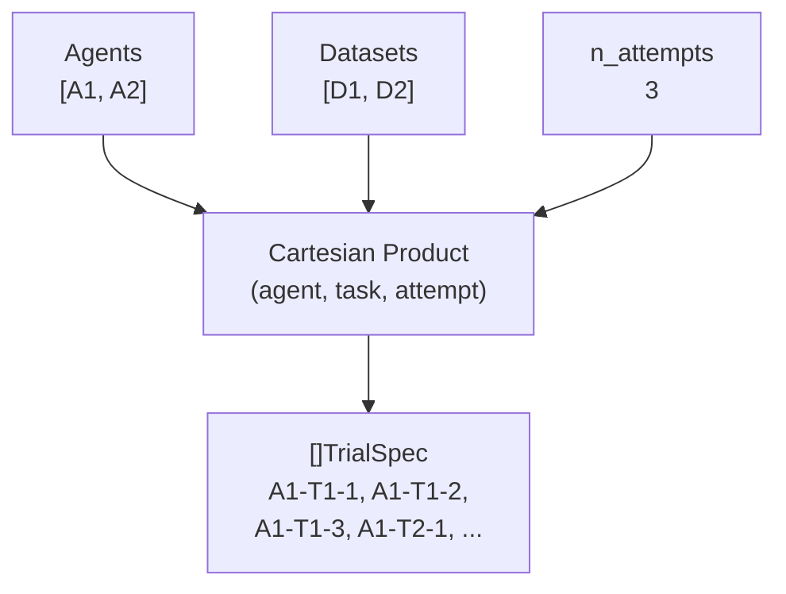
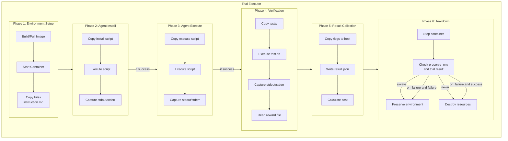
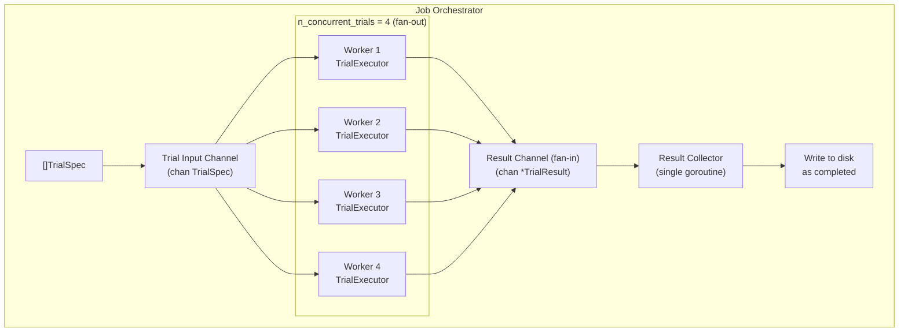
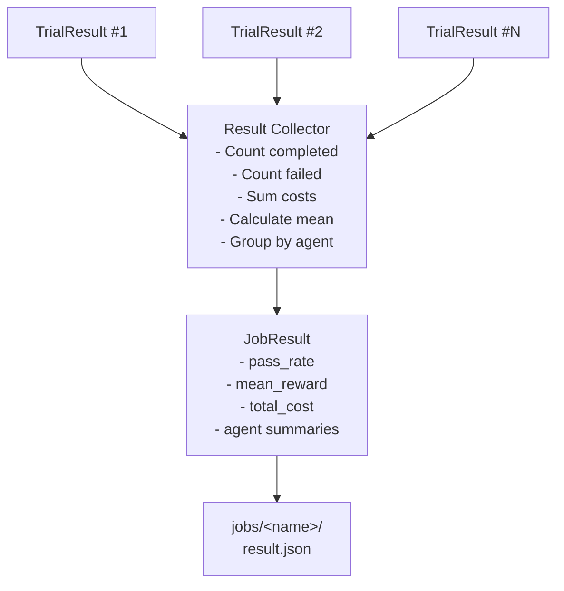

# Rollout Architecture

This document describes the internal architecture of Rollout, including Go interfaces, data models, and the data flow from job definition to trial results.

## Overview

Rollout follows a modular architecture with clear separation of concerns:



## Data Models

### Task Configuration

```go
// TaskConfig represents the parsed task.toml configuration.
type TaskConfig struct {
	Version  string            `toml:"version"`
	Source   *string           `toml:"source,omitempty"`
	Metadata map[string]any    `toml:"metadata,omitempty"`
	Verifier VerifierConfig    `toml:"verifier"`
	Agent    AgentTaskConfig   `toml:"agent"`
	Env      EnvironmentConfig `toml:"environment"`
}

type VerifierConfig struct {
	TimeoutSec float64 `toml:"timeout_sec"` // default: 600.0
}

type AgentTaskConfig struct {
	InstallTimeoutSec float64 `toml:"install_timeout_sec"` // default: 300.0
	TimeoutSec        float64 `toml:"timeout_sec"`         // default: 600.0
}

type EnvironmentConfig struct {
	BuildTimeoutSec float64 `toml:"build_timeout_sec"` // default: 600.0
	DockerImage     *string `toml:"docker_image,omitempty"`
	CPUs            int     `toml:"cpus"`    // default: 1
	MemoryMB        int     `toml:"memory_mb"`  // default: 2048
	StorageMB       int     `toml:"storage_mb"` // default: 10240
    // Deprecated fields: Memory, Storage
}
```

### Task

```go
// Task represents a fully loaded task ready for execution.
type Task struct {
	Name        string
	FS          fs.FS       // filesystem rooted at task directory
	Config      TaskConfig
	GitCommitID *string     // resolved git SHA, nil if not in git repo
}

// Task provides methods to access well-known paths within the task filesystem.
// These return fs.File or sub-filesystems for the task components.

func (t *Task) Instruction() (fs.File, error) {
	return t.FS.Open("instruction.md")
}

func (t *Task) Environment() (fs.FS, error) {
	return fs.Sub(t.FS, "environment")
}

func (t *Task) Solution() (fs.FS, error) {
	return fs.Sub(t.FS, "solution")
}

func (t *Task) Tests() (fs.FS, error) {
	return fs.Sub(t.FS, "tests")
}
```

### Dataset

```go
// Dataset represents a collection of tasks.
type Dataset struct {
	Name    string
	Version string
	Tasks   []Task
}

// RegistryEntry represents a dataset entry in registry.json.
type RegistryEntry struct {
	Name        string              `json:"name"`
	Version     string              `json:"version"`
	Description string              `json:"description"`
	Tasks       []RegistryTaskEntry `json:"tasks"`
}

// RegistryTaskEntry represents a task reference in a registry.
type RegistryTaskEntry struct {
	Name        string  `json:"name"`
	GitURL      string  `json:"git_url"`
	GitCommitID *string `json:"git_commit_id,omitempty"`
	Path        string  `json:"path,omitempty"`
}
```

### Agent

```go
// Agent represents an agent definition from job.yaml.
type Agent struct {
	Name        string            `yaml:"name" json:"name"`
	Description string            `yaml:"description,omitempty" json:"description,omitempty"`
	Install     string            `yaml:"install,omitempty" json:"install,omitempty"`
	Execute     string            `yaml:"execute,omitempty" json:"execute,omitempty"`
	Env         map[string]string `yaml:"env,omitempty" json:"env,omitempty"`
}

// IsOracle returns true if this is the special oracle agent.
func (a Agent) IsOracle() bool {
	return a.Name == "oracle"
}
```

### Job Configuration

```go
// JobConfig represents the parsed job.yaml configuration.
type JobConfig struct {
	Name              *string              `yaml:"name,omitempty" json:"name,omitempty"`
	JobsDir           string               `yaml:"jobs_dir" json:"jobs_dir"` // default: "jobs"
	NAttempts         int                  `yaml:"n_attempts" json:"n_attempts"` // default: 1
	NConcurrentTrials int                  `yaml:"n_concurrent_trials" json:"n_concurrent_trials"`
	TimeoutMultiplier float64              `yaml:"timeout_multiplier" json:"timeout_multiplier"` // default: 1.0
	Retry             RetryConfig          `yaml:"retry,omitempty" json:"retry,omitempty"`
	LogLevel          string               `yaml:"log_level,omitempty" json:"log_level,omitempty"`
	InstructionPath   string               `yaml:"instruction_path" json:"instruction_path"` // default: "/tmp/instruction.md"
	Environment       JobEnvironmentConfig `yaml:"environment" json:"environment"`
	Verifier          JobVerifierConfig    `yaml:"verifier,omitempty" json:"verifier,omitempty"`
	Metrics           []MetricConfig       `yaml:"metrics,omitempty" json:"metrics,omitempty"`
	Agents            []Agent              `yaml:"agents" json:"agents"`
	Datasets          []DatasetRef         `yaml:"datasets" json:"datasets"`
}

type RetryConfig struct {
	MaxAttempts    int     `yaml:"max_attempts" json:"max_attempts"`       // default: 3
	InitialDelayMs int     `yaml:"initial_delay_ms" json:"initial_delay_ms"` // default: 1000
	MaxDelayMs     int     `yaml:"max_delay_ms" json:"max_delay_ms"`       // default: 30000
	Multiplier     float64 `yaml:"multiplier" json:"multiplier"`         // default: 2.0
}

type JobEnvironmentConfig struct {
	Type              string         `yaml:"type" json:"type"` // "docker", "k8s", "modal", etc.
	ForceBuild        bool           `yaml:"force_build" json:"force_build"`
	PreserveEnv       PreservePolicy `yaml:"preserve_env" json:"preserve_env"` // default: "never"
	ProviderConfig    map[string]any `yaml:"provider_config,omitempty" json:"provider_config,omitempty"`
	OverrideCPUs      *int           `yaml:"override_cpus,omitempty" json:"override_cpus,omitempty"`
	OverrideMemoryMB  *int           `yaml:"override_memory_mb,omitempty" json:"override_memory_mb,omitempty"`
	OverrideStorageMB *int           `yaml:"override_storage_mb,omitempty" json:"override_storage_mb,omitempty"`
}

// PreservePolicy controls environment cleanup behavior.
type PreservePolicy string

const (
	PreserveNever     PreservePolicy = "never"
	PreserveAlways    PreservePolicy = "always"
	PreserveOnFailure PreservePolicy = "on_failure"
)

type JobVerifierConfig struct {
	OverrideTimeoutSec *float64 `yaml:"override_timeout_sec,omitempty" json:"override_timeout_sec,omitempty"`
	MaxTimeoutSec      *float64 `yaml:"max_timeout_sec,omitempty" json:"max_timeout_sec,omitempty"`
	Disable            bool     `yaml:"disable" json:"disable"`
}

type MetricConfig struct {
	Type string `yaml:"type" json:"type"` // "sum", "min", "max", "mean"
}

// DatasetRef specifies how to load a dataset.
type DatasetRef struct {
	Path     *string      `yaml:"path,omitempty" json:"path,omitempty"`
	Registry *RegistryRef `yaml:"registry,omitempty" json:"registry,omitempty"`
	Name     string       `yaml:"name,omitempty" json:"name,omitempty"`
	Version  string       `yaml:"version,omitempty" json:"version,omitempty"`
}

type RegistryRef struct {
	Path *string `yaml:"path,omitempty" json:"path,omitempty"`
	URL  *string `yaml:"url,omitempty" json:"url,omitempty"`
}
```

### Trial

```go
// Trial represents a single agent attempt at a task.
type Trial struct {
	ID          string // unique identifier
	Task        Task
	Agent       Agent
	Dataset     string
	Attempt     int
	OutputDir   string // path to trial output directory
}

// TrialSpec is the input specification for creating a trial.
type TrialSpec struct {
	Task    Task
	Agent   Agent
	Dataset string
	Attempt int
}
```

### Trial Result

```go
// TrialResult contains the outcome of a trial execution.
type TrialResult struct {
	TaskName        string       `json:"task_name"`
	DatasetName     string       `json:"dataset_name"`
	AgentName       string       `json:"agent_name"`
	Attempt         int          `json:"attempt"`
	TaskGitCommitID *string      `json:"task_git_commit_id"`
	Reward          *float64     `json:"reward"`
	Cost            float64      `json:"cost"`
	Error           *TrialError  `json:"error"`
	Durations       Durations    `json:"durations"`
	Timestamps      Timestamps   `json:"timestamps"`
	VerifierStdout  string       `json:"verifier_stdout,omitempty"`
	VerifierStderr  string       `json:"verifier_stderr,omitempty"`
}

type TrialError struct {
	Type    ErrorType `json:"type"`
	Message string    `json:"message"`
}

type Durations struct {
	TotalSec            float64  `json:"total_sec"`
	EnvironmentSetupSec *float64 `json:"environment_setup_sec"`
	AgentSetupSec       *float64 `json:"agent_setup_sec"`
	AgentExecutionSec   *float64 `json:"agent_execution_sec"`
	VerifierSec         *float64 `json:"verifier_sec"`X
}

type Timestamps struct {
	StartedAt                 time.Time  `json:"started_at"`
	EnvironmentSetupStartedAt time.Time  `json:"environment_setup_started_at"`
	EnvironmentSetupEndedAt   time.Time  `json:"environment_setup_ended_at"`
	AgentSetupStartedAt       time.Time  `json:"agent_setup_started_at"`
	AgentSetupEndedAt         time.Time  `json:"agent_setup_ended_at"`
	AgentExecutionStartedAt   time.Time  `json:"agent_execution_started_at"`
	AgentExecutionEndedAt     time.Time  `json:"agent_execution_ended_at"`
	VerifierStartedAt         *time.Time `json:"verifier_started_at"`
	VerifierEndedAt           *time.Time `json:"verifier_ended_at"`
	EndedAt                   time.Time  `json:"ended_at"`
}
```

### Error Types

```go
// ErrorType identifies the category of error that occurred.
type ErrorType string

const (
	// Environment build phase
	ErrEnvironmentBuildFailed               ErrorType = "environment_build_failed"
	ErrEnvironmentBuildTimeout              ErrorType = "environment_build_timeout"
	ErrEnvironmentImagePullFailed           ErrorType = "environment_image_pull_failed"

	// Environment start phase
	ErrEnvironmentStartFailed               ErrorType = "environment_start_failed"
	ErrEnvironmentResourceAllocationFailed  ErrorType = "environment_resource_allocation_failed"

	// Agent install phase
	ErrAgentInstallFailed                   ErrorType = "agent_install_failed"
	ErrAgentInstallTimeout                  ErrorType = "agent_install_timeout"

	// Agent execution phase
	ErrAgentExecutionFailed                 ErrorType = "agent_execution_failed"
	ErrAgentExecutionTimeout                ErrorType = "agent_execution_timeout"

	// Verification phase
	ErrVerifierFailed                       ErrorType = "verifier_failed"
	ErrVerifierTimeout                      ErrorType = "verifier_timeout"
	ErrVerifierRewardMissing                ErrorType = "verifier_reward_missing"
	ErrVerifierRewardInvalid                ErrorType = "verifier_reward_invalid"

	// Teardown phase
	ErrEnvironmentTeardownFailed            ErrorType = "environment_teardown_failed"

	// Pre-execution
	ErrTaskInvalid                          ErrorType = "task_invalid"
	ErrTaskNotFound                         ErrorType = "task_not_found"

	// Catch-all
	ErrInternalError                        ErrorType = "internal_error"
)
```

### Job Result

```go
// JobResult contains aggregate metrics across all trials.
type JobResult struct {
	JobName          string                  `json:"job_name"`
	Cancelled        bool                    `json:"cancelled"`
	TotalTrials      int                     `json:"total_trials"`
	CompletedTrials  int                     `json:"completed_trials"`
	FailedTrials     int                     `json:"failed_trials"`
	SkippedTrials    int                     `json:"skipped_trials"`
	PassRate         float64                 `json:"pass_rate"`
	MeanReward       float64                 `json:"mean_reward"`
	TotalCost        float64                 `json:"total_cost"`
	TotalDurationSec float64                 `json:"total_duration_sec"`
	StartedAt        time.Time               `json:"started_at"`
	EndedAt          time.Time               `json:"ended_at"`
	Agents           map[string]AgentSummary `json:"agents"`
	Results          []TrialSummary          `json:"results"`
}

type AgentSummary struct {
	TotalTrials     int     `json:"total_trials"`
	CompletedTrials int     `json:"completed_trials"`
	FailedTrials    int     `json:"failed_trials"`
	PassRate        float64 `json:"pass_rate"`
	MeanReward      float64 `json:"mean_reward"`
	TotalCost       float64 `json:"total_cost"`
}

type TrialSummary struct {
	TaskName    string   `json:"task_name"`
	DatasetName string   `json:"dataset_name"`
	AgentName   string   `json:"agent_name"`
	Attempt     int      `json:"attempt"`
	Reward      *float64 `json:"reward"`
}
```

## Interfaces

### Environment Provider

The environment provider is a factory that creates environments. Each provider implementation (Docker, Modal, Kubernetes) returns its own concrete `Environment` that knows how to manage itself.

```go
// Environment represents a running container environment.
// Each provider returns its own implementation (DockerEnvironment, ModalEnvironment, etc.)
// that encapsulates provider-specific details like container IDs or app references.
type Environment interface {
	// ID returns the unique identifier for this environment.
	ID() string

	// CopyTo copies a local file or directory into the environment.
	CopyTo(ctx context.Context, src, dst string) error

	// CopyFrom copies a file or directory from the environment to local path.
	CopyFrom(ctx context.Context, src, dst string) error

	// Exec executes a command in the environment, streaming stdout and stderr to the provided writers.
	// Returns the exit code or error on failure.
	Exec(ctx context.Context, cmd string, stdout, stderr io.Writer, opts ExecOptions) (int, error)

	// Stop stops the environment but does not remove it.
	Stop(ctx context.Context) error

	// Destroy removes the environment and cleans up all resources.
	// This is provider-specific: removes Docker containers, deletes Modal apps, etc.
	Destroy(ctx context.Context) error

	// Cost returns the cost incurred by this environment.
	// Tracked internally by the implementation based on resource usage and duration.
	Cost() float64
}

type ExecOptions struct {
	Env     map[string]string
	Timeout time.Duration
	WorkDir string
}

// EnvironmentProvider is a factory for creating environments.
// It handles image building/pulling and environment creation.
// Lifecycle management (destroy, cost) is delegated to the Environment itself.
type EnvironmentProvider interface {
	// Name returns the provider name (e.g., "docker", "modal", "k8s").
	Name() string

	// BuildImage builds a container image from the given context directory.
	// Returns an image reference that can be used with CreateEnvironment.
	BuildImage(ctx context.Context, opts BuildImageOptions) (string, error)

	// PullImage pulls a pre-built image from a registry.
	PullImage(ctx context.Context, imageRef string) error

	// CreateEnvironment creates and starts a new environment from an image.
	// The returned Environment handles its own lifecycle (Stop, Destroy, Cost).
	CreateEnvironment(ctx context.Context, opts CreateEnvironmentOptions) (Environment, error)
}

type BuildImageOptions struct {
	ContextDir string
	Tag        string
	Timeout    time.Duration
	NoCache    bool
}

type CreateEnvironmentOptions struct {
	ImageRef string
	CPUs     string
	Memory   string
	Storage  string
	Env      map[string]string
	Config   map[string]any // provider-specific configuration
}
```

### Task Loader

```go
// TaskLoader loads tasks from various sources.
type TaskLoader interface {
	// LoadTask loads a single task from a filesystem.
	// The fsys should be rooted at the task directory.
	// For local filesystem tasks, LoadTask attempts to resolve the git commit SHA
	// from the repository (or sets TaskGitCommitID to nil if not in a git repo).
	LoadTask(ctx context.Context, fsys fs.FS) (*Task, error)

	// ValidateTask validates a task's structure and configuration.
	ValidateTask(task *Task) error
}
```

### Dataset Loader

```go
// DatasetLoader loads datasets from local paths or registries.
type DatasetLoader interface {
	// LoadFromFS loads all tasks from a dataset filesystem.
	// The fsys should be rooted at the dataset directory containing task subdirectories.
	LoadFromFS(ctx context.Context, fsys fs.FS, name string) (*Dataset, error)

	// LoadFromRegistry loads a dataset from a registry.
	// Downloads tasks to a local cache and returns the loaded dataset.
	LoadFromRegistry(ctx context.Context, registry RegistryRef, name, version string) (*Dataset, error)
}
```

### Registry Client

```go
// RegistryClient fetches dataset definitions from registries.
type RegistryClient interface {
	// FetchRegistry retrieves the registry entries from a URL or local path.
	FetchRegistry(ctx context.Context, ref RegistryRef) ([]RegistryEntry, error)

	// FetchTask downloads a task from a git repository.
	FetchTask(ctx context.Context, entry RegistryTaskEntry) (string, error)
}
```

### Trial Executor

```go
// TrialExecutor runs a single trial through all phases.
type TrialExecutor interface {
	// Execute runs the trial and returns the result.
	// The result is also written to disk as execution progresses.
	Execute(ctx context.Context, trial Trial, provider EnvironmentProvider) (*TrialResult, error)
}
```

### Result Collector

```go
// ResultCollector aggregates and persists trial results.
type ResultCollector interface {
	// Collect consumes results from the channel, writes each to disk,
	// and returns the aggregated JobResult when the channel closes.
	Collect(ctx context.Context, results <-chan *TrialResult) (*JobResult, error)
}
```

### Job Orchestrator

```go
// JobOrchestrator coordinates the execution of all trials in a job.
type JobOrchestrator interface {
	// Run executes all trials defined by the job configuration.
	// Returns the aggregated job result.
	Run(ctx context.Context) (*JobResult, error)

	// Cancel signals the orchestrator to stop accepting new trials.
	Cancel()
}
```

## Data Flow

### 1. Job Initialization



### 2. Trial Generation



### 3. Trial Execution (per trial)



### 4. Concurrent Execution

Uses a fan-out/fan-in pattern with channels for coordination.



### 5. Result Aggregation



## Package Structure

```
rollout/
├── cmd/
│   └── rollout/
│       └── main.go           # CLI entry point
├── internal/
│   ├── config/
│   │   ├── job.go            # JobConfig parsing and validation
│   │   └── task.go           # TaskConfig parsing and validation
│   ├── dataset/
│   │   ├── loader.go         # DatasetLoader implementation
│   │   └── registry.go       # RegistryClient implementation
│   ├── environment/
│   │   ├── provider.go       # EnvironmentProvider interface
│   │   ├── apple/
│   │   │   └── apple.go      # Apple Container provider (macOS VM-based, uses tar piping for file transfer)
│   │   ├── docker/
│   │   │   └── docker.go     # Docker provider (local containers)
│   │   ├── modal/
│   │   │   └── modal.go      # Modal provider (cloud sandboxes via modal-go SDK)
│   │   └── k8s/
│   │       └── k8s.go        # Kubernetes provider (future)
│   ├── executor/
│   │   ├── trial.go          # TrialExecutor implementation
│   │   └── orchestrator.go   # JobOrchestrator implementation
│   ├── models/
│   │   ├── task.go           # Task, TaskConfig types
│   │   ├── agent.go          # Agent type
│   │   ├── trial.go          # Trial, TrialResult types
│   │   ├── job.go            # JobConfig, JobResult types
│   │   └── errors.go         # ErrorType constants
│   ├── result/
│   │   ├── collector.go      # ResultCollector implementation
│   │   └── metrics.go        # Metric calculations
│   └── task/
│       └── loader.go         # TaskLoader implementation
└── go.mod
```

## Error Handling Strategy

1. **Fail fast on configuration errors**: Invalid job.yaml or task.toml should fail before any trials start.

2. **Isolate trial failures**: A failure in one trial should not affect other trials. Each trial runs independently.

3. **Record all errors**: Every error is captured in the trial's result.json with a typed error code.

4. **Graceful cancellation**: SIGINT/SIGTERM triggers graceful shutdown—running trials complete their current phase, queued trials are marked as skipped.

5. **Retry transient failures**: Infrastructure failures (network, provider API errors) are retried with exponential backoff per the retry configuration.

6. **Conditional environment cleanup**: Environment teardown follows the `preserve_env` setting:
   - `"never"`: Always destroy the environment after trial completion.
   - `"always"`: Always preserve the environment for inspection.
   - `"on_failure"`: Preserve only if the trial failed (non-zero reward or error), otherwise destroy to save resources.

## Concurrency Model

- **Fan-out**: `n_concurrent_trials` worker goroutines consume from a shared input channel (`chan TrialSpec`).
- **Fan-in**: Workers send completed results to a single result channel (`chan *TrialResult`).
- **Result collection**: A dedicated collector goroutine reads from the result channel and writes to disk. No mutex needed—single consumer.
- **Context propagation**: All long-running operations accept `context.Context` for cancellation support.
- **Resource cleanup**: Uses `defer` patterns to ensure environments are cleaned up even on panic/error.
